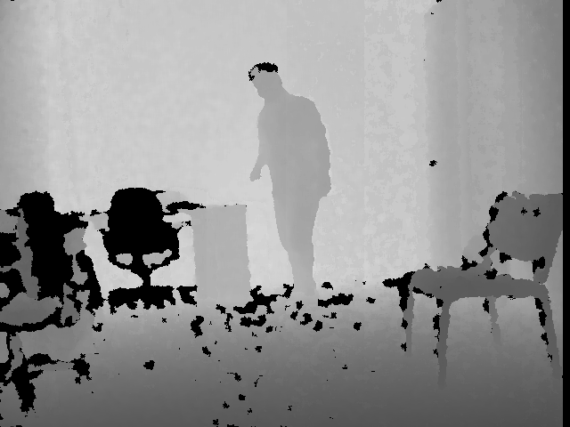
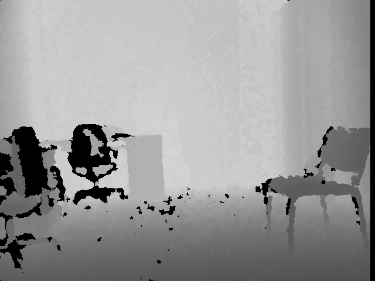
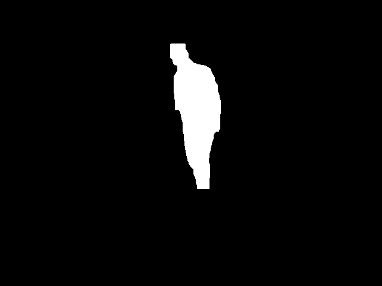
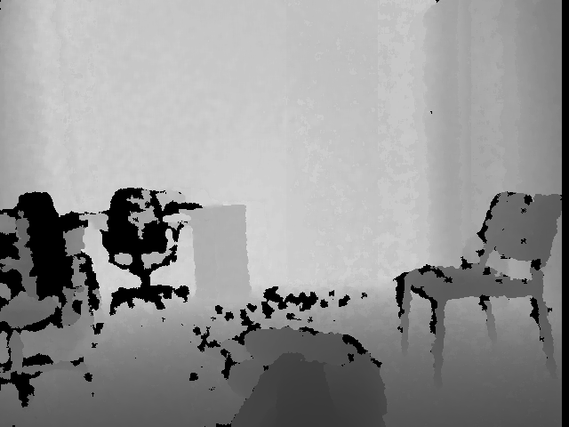
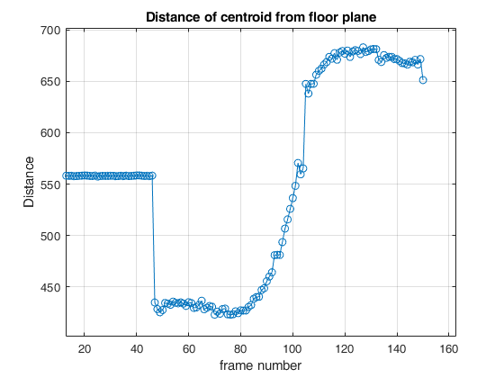
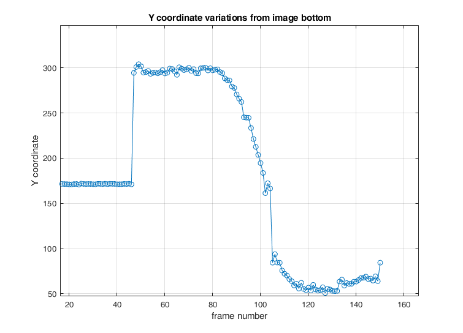

# Fall_detection_systemC
SystemC modelling of fall detection given in http://fenix.univ.rzeszow.pl/~mkepski/ds/uf.html

# Dependencies
OpenCV library and SystemC library

# Background extraction

# Person extraction

# After fall occured

# Result plot for centroid distance in 3D space, only Y coordinate and bounding box ratio

